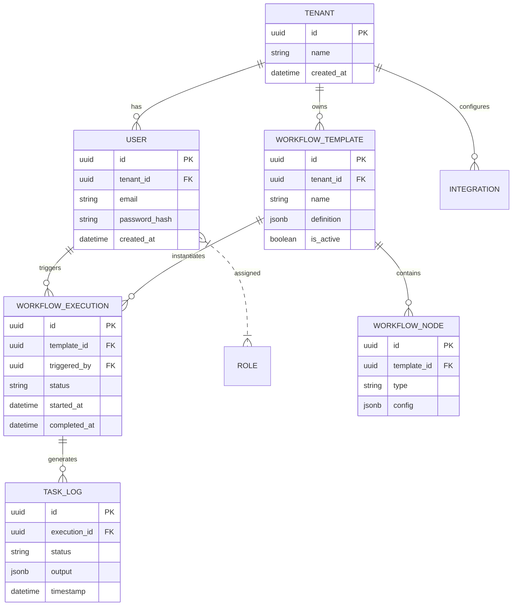

# Entity Relationship Diagram

The following Mermaid diagram outlines the core relationships within the AIOS PostgreSQL database.

```mermaid
erDiagram
    TENANT ||--o{ USER : has
    TENANT ||--o{ WORKFLOW_TEMPLATE : owns
    TENANT ||--o{ INTEGRATION : configures

    USER ||--o{ WORKFLOW_EXECUTION : triggers
    USER }|..|{ ROLE : assigned

    WORKFLOW_TEMPLATE ||--o{ WORKFLOW_EXECUTION : instantiates
    WORKFLOW_TEMPLATE ||--o{ WORKFLOW_NODE : contains

    WORKFLOW_EXECUTION ||--o{ TASK_LOG : generates

    TENANT {
        uuid id PK
        string name
        datetime created_at
    }

    USER {
        uuid id PK
        uuid tenant_id FK
        string email
        string password_hash
        datetime created_at
    }

    WORKFLOW_TEMPLATE {
        uuid id PK
        uuid tenant_id FK
        string name
        jsonb definition
        boolean is_active
    }

    WORKFLOW_NODE {
        uuid id PK
        uuid template_id FK
        string type
        jsonb config
    }

    WORKFLOW_EXECUTION {
        uuid id PK
        uuid template_id FK
        uuid triggered_by FK
        string status
        datetime started_at
        datetime completed_at
    }

    TASK_LOG {
        uuid id PK
        uuid execution_id FK
        string status
        jsonb output
        datetime timestamp
    }
```
